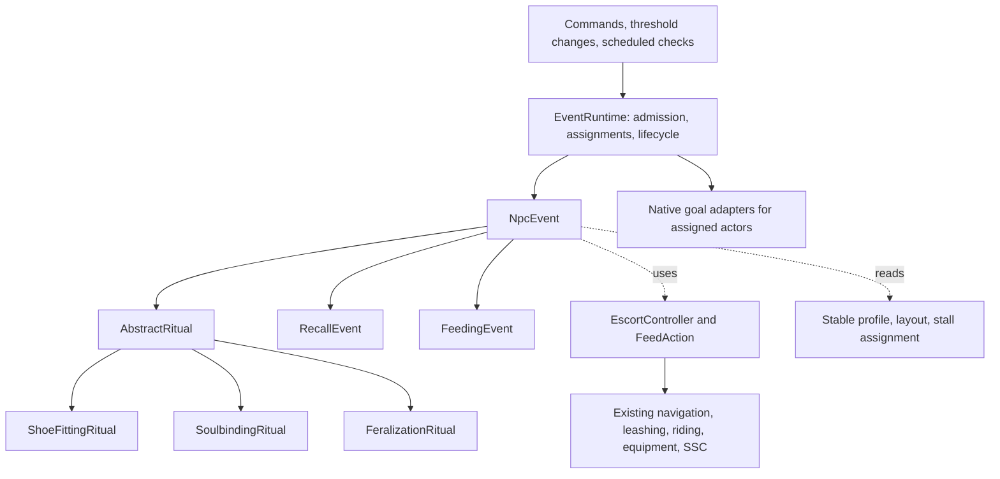

# SSC Extras: NPC events and stable architecture review

Reviewed 7 October 2026 against the local source, version 1.23.32.

**Assessment:** the mod has useful shared mechanics, but its NPC orchestration needs clearer ownership. Introduce a small event lifecycle, an abstract ritual with reusable compositions and stages, shared escort/feeding actions and soul animations, and explicit stable profiles. Keep the existing native goals, navigation, equipment, transformation, and networking paths underneath them.

The original review follows the ritual, feeding, capture, roaming, riding, stable, persistence, and presentation paths; the other feature packages were sampled for architectural boundaries rather than exhaustively audited. Its source links and findings below describe the 1.23.32 baseline. The delivery sections describe the implemented ritual, escort, movement, and progression foundations; the remaining architecture sections are the longer-term design.

## Implemented in 1.26.0

- Mount Merchants use a separate 13-by-11 structure with placement tied to outpost/mansion candidates 16 chunks away. Keeping the market's own chunk references avoids expanding the original structure's bounds across that distance.
- Merchant conversion uses `NpcEvent`, `RitualStageRunner`, and `LeashEscortEvent` with native equipment, catalysts, instinct attacks, and transformation completion. Its saved checkpoint belongs to the merchant because an unsold player has no stable claim.
- Server-side trade actions recheck price, stock, confirmation, and eligibility. Buyers select a ready player first, reserve only vacant stalls, and reuse native ownership and leash delivery. `MountMarket` persists offers, active buyers, and NPC stall reservations; transient movement reservations are released on unload.

## Implemented in 1.25.0

- `QuadrupedMovement.STEP_HEIGHT` is 1.125 blocks for quadrupedal player drakes and resident drakes. This admits a full block with carpet or a thin covering, while remaining below the 1.5-block fence/closed-gate collision height. The existing final collision-height compatibility hook uses the same value; posture and ordinary upright movement retain their native paths.
- `LeashEscortEvent` is a reusable `NpcEvent` carrying a guide, target, dimension, starting point, destination, and immutable movement template. Capture, ritual collection, and range correction use it for separation checks, throttled path requests, recovery, and terminal cleanup. Native goals still select destinations, handle stable gates, recognize arrival, and commit capture/ritual outcomes. Ritual escorts borrow their parent's reservations; independent escorts reserve their own guide and target. Handoff releases only the old run's reservations without detaching a newer guide.
- `LeashRecovery` detects a taut, terrain-constrained lead without meaningful target movement for 40 ticks. Pulling pauses while the guide routes back toward the target. Once the target is grounded and the pair are close at compatible heights, the normal route resumes. Recovery has a 160-tick limit and bounds repeated attempts; failure releases the NPC lead and blocks immediate reattachment by that guide for 100 ticks. Interrupted ritual collection releases its team, retains its ritual checkpoint, and delays another attempt. This does not raise step height, teleport the target, or increase force. Ordinary player-held and post-tied leads retain their existing behavior.
- `ProgressionState` persists accounts by the subject's UUID, independently of stable claims. It stores metric totals, accepted quests, objective counts, completion, and configured points. `QuestRegistry` holds immutable definitions; `QuestObjective` supports counters and actor/dimension/location predicates. Acceptance is explicit, prior totals are not replayed into new quests, and a completed quest grants its configured reward once. Unknown quest IDs retain their saved progress. Definitions and objective IDs must remain stable across updates or receive a migration.
- `MountRideSession` observes legitimate passenger changes and server ticks through the existing riding lifecycle. It records ride starts, active ridden ticks, and observed distance, batching duration/distance every 20 ticks and flushing on dismount, rider change, save, or disconnect. Duplicate ticks, offline gaps, and position jumps over eight blocks per tick do not generate extra time or travel credit. Statistics carry the rider UUID and sampled location. They do not change control packets, saddle/rein checks, passenger positioning, or cargo access.
- **No concrete quests, automatic quest acceptance, reward rates, hauling mechanics, or sales are enabled.** The live riding metrics are the inputs for later quest design; they grant no points by themselves. Batched locations describe the latest observed position, not proof of every point traversed or an ordered journey.

### Adding progression and escort uses

Register a `QuestDefinition` during common initialization, then explicitly call `ProgressionState.get(server).accept(subjectUuid, questId)` from the eventual quest-giver/command/UI. Publish positive `ProgressEvent`s from authoritative gameplay callbacks. Use the subject UUID for the player or entity earning progress, and `actor` for the rider/customer/other participant. Query `progress`, `completed`, `total`, and `points` for presentation. Only accepted, unfinished objectives matching the emitted metric are indexed and evaluated; there is no per-tick scan over every registered quest. Repeatable assignments, per-assignment destination data, prerequisites, rewards beyond points, and UI should follow the eventual quest rules rather than be inferred now.

For another pillager-led player route, attach its legitimate lead, start `LeashEscortEvent` with the destination and optional parent event, and drive `move(waypoint, speed, direct)` from the actor's existing goal. Always finish on cancellation and goal stop; use `handoff()` only when another activity is taking over the same physical lead. The caller owns route-specific gate/site selection and arrival effects. Recovery temporarily overrides the waypoint; it never assumes a straight pull through terrain will succeed. The current adapter deliberately uses the existing pillager/player navigation mechanics, while the event lifecycle and recovery state machine remain reusable.

### Riding, cargo, and ownership review

The current mount system already centralizes passenger eligibility, reins-based control, native movement, and rider input in `DrakeRiding`. `RiderChestInventory` shares the same item-backed cargo inventory between player and resident mounts, with native container behavior and equipment/distance/world access checks. Future hauling should reuse that cargo boundary, adding load/job rules separately; a cart or tow connection should have its own attachment lifecycle rather than masquerade as a passenger. Mounted pursuit still lives partly in `DrakeBattleGoal`; extraction of that controller remains useful when a second transport job needs it.

Stable housing, legal ownership, temporary control, and personal progression are distinct responsibilities. Progression is now independent of housing, so releasing or changing a stable claim does not erase mount history. Future sales should add an explicit owner identity and a transfer operation that releases old jobs, validates the destination reservation, and transfers housing/control deliberately. Neither stall coordinates nor the current rider should become the owner identifier. Existing `Claim` fields and saved ownership rules remain compatible; village sales and ownership transfer policy are deferred until designed.

Validation: the 1.25.0 build and remapped GameTest package succeeded; all 177 packaged-mod server GameTests passed in a fresh isolated world, including six new framework tests. These exercise persistent/isolated quest progress and single rewards, rider/time/distance accounting, actor/world/destination predicates, actual cliff collision and guide backtracking, reservation handoff, carpet stepping, and closed-gate blocking. The existing ritual collection regression caught and corrected a changed final approach speed/stopping distance. A pre-existing shared-knot fixture failure was reproduced with the 1.24.0 package and fixed by waiting for its forced chunks to track entities before testing. Evidence: `build/gametest-results.xml`, `.work/mount-framework-all.log`, `.work/mount-framework-build.log`, and `build/mount-framework-gametest-20261007-165943/launch.log`. No client session, full modpack playtest, or performance benchmark was run.

## Implemented in 1.24.0

- `NpcEvent` owns run identity and idempotent terminal release. `EventAssignments` acquires actor/target UUIDs atomically and supports direct participant lookup. Ritual keepers now resolve their target through this table instead of scanning players.
- `AbstractRitual` owns the performance runner, assignment token, composition, and interruption hooks. `SoulbindingRitual`, `FeralizationRitual`, and `ShoeFittingRitual` supply their own stages, actor duties, displayed items, and outcomes. `DrakeRituals` supplies command enumeration and natural eligibility; there is no ritual enum to extend.
- `RitualComposition.threeEnforcers()` defines named guide, assistant, and specialist slots and their formation. Participant loops use the composition size. Custom compositions must include a guide for the existing escort adapter; specific rituals declare any additional slots they use.
- `RitualStage` supports duration, condition, both, or either; a completion commit; a bounded timeout; and pause, restart-stage, named-stage, or cancel fallbacks. `RitualStageRunner` advances at most one stage per update. Each checkpoint stores its current stage, elapsed active time, and committed stage IDs.
- **Existing rituals preserve progress on interruption.** Repositioning pauses the current stage. Losing holders, disconnecting, or changing dimensions releases participants while retaining the checkpoint. Reacquisition or reconnect resumes the saved stage. Completed catalyst uses and shoe-pair commits are retained. Only an unfinished continuous-chewing bite restarts. Clearing an effect/claim deliberately clears its associated pending ritual.
- The checkpoint is versioned and saved inside the existing ownership record. Live actors, navigation, displayed items, and an unfinished bite are not deserialized. Unavailable definitions retain their saved checkpoints without restraining the player. Timeout accounting starts a new bounded attempt after reacquisition; no offline duration is credited. Separate Minecraft entity/ownership saves are not a transactional crash journal.
- `SoulAnimation` and `SoulAnimationStage` supply reusable rise, hover/reshape, and return clips. `DrakeSoulAnimations` registers immutable sequences; `SoulRitual` accepts a sequence ID. The server uses that sequence's stage durations and publishes its ID with the existing tracked progress. The client samples the sequence while retaining native skin/form rendering. The current renderer supports Original Shifter and the four drake forms.
- Ordinary feeding now rejects both ritual targets and assigned ritual keepers, including when continuing an existing feeding goal.

This delivery retains the existing native goal priority, escort/navigation, item consumption, and permanent-effect paths. Collection and release coordination still live in the `DrakeSoulbinding` facade; the claim retains the transient attendant list for existing native callers. Legacy capture, battle, and recruitment exclusions remain in admission checks. Migrating those other activities into the assignment service, extracting a common escort/feed action, stable profiles/layout metadata, repair/discovery caches, and richer run/revision presentation snapshots remain subsequent steps. This change does not claim measured server tick or frame-rate gains.

Validation: the 1.24.0 build and remapped GameTest package succeeded; all 171 packaged-mod server GameTests passed in the isolated test world, including six new framework tests. Animation samples were compared against the previous curves at quarter-tick intervals over the full 360-tick sequence. No client visual session or performance benchmark was run. Evidence: `build/gametest-results.xml` and `.work/ritual-framework-build.log`.

### Adding a ritual

1. Subclass `AbstractRitual`, or `SoulRitual` for the shared soul/body/feed sequence. Supply a composition, stable stage IDs, actor duties, optional displayed items/positions, and the completion effect. Pass the supplied `DrakeRitualCheckpoint` to the constructor so resumed runs reuse it.
2. Assemble stages with `RitualStage.afterAndWhen(...)`, or use the record constructor for other completion/fallback policies. A successful commit returns `true`; a failed commit remains pending until its timeout. Keep effects out of proceed predicates. A stage ID's commit is never replayed after fallback or reload; repeated intentional effects need distinct IDs or an explicit persisted count.
3. Register a `DrakeRituals.Type(command, duePredicate, factory)` during common initialization before command registration/world loading. Register custom soul sequences on both logical sides using `DrakeSoulAnimations.register(id, sequence)`. Supply that ID to the three-argument `SoulRitual` constructor. Its sequence must end in a return-to-body clip, and its last preceding clip gates on body readiness.
4. Keep stage IDs stable across versions or provide a checkpoint migration. Add a focused GameTest for the new outcome, interruption, and shared actor conflicts. The `rituals` test suite covers runner policies, isolation, reservations, animation equivalence, and a saved interrupted shoe-fitting run.

## Current structure

| Area | Assessment | Evidence and implication |
| --- | --- | --- |
| Feature separation | Good foundation | Collars, cuffs, effigy, client rendering, and mixins have distinct packages. `SscExtras` mostly registers features. `CollarSlots`, `ConfiguredLootChance`, and `InfusionComponents` demonstrate useful shared boundaries. |
| Rituals | Highest priority for extraction | [DrakeSoulbinding](<E:/Java Projects/SSCExtras/src/main/java/sscextras/drake/DrakeSoulbinding.java:193>) handles three rituals, eligibility, recruitment, escort coordination, feeding, presentation, completion, permanent effects, and respawn. Its enum identifies rituals, but implementation branches remain throughout the coordinator and NPC goal. |
| State ownership | Mixed responsibilities | [Claim](<E:/Java Projects/SSCExtras/src/main/java/sscextras/drake/DrakeOutpostOwnership.java:41>) contains durable assignment/progression alongside live attendants, ritual counters, escort IDs, and presentation-related state. The NBT writer already omits most live ritual fields; preserve that distinction while separating their owners. |
| NPC coordination | Distributed conflict checks | [DrakeSoulbinding.available](<E:/Java Projects/SSCExtras/src/main/java/sscextras/drake/DrakeSoulbinding.java:447>) inspects battle, capture, and recruitment goals. Battle, feeding, petting, and roaming independently check other activities. Adding a behavior currently requires teaching multiple existing behaviors about it. |
| Escort and riding | Mechanics shared; orchestration coupled | [DrakeCaptureGoal](<E:/Java Projects/SSCExtras/src/main/java/sscextras/drake/DrakeCaptureGoal.java:189>) and [DrakeRitualGoal](<E:/Java Projects/SSCExtras/src/main/java/sscextras/drake/DrakeRitualGoal.java:37>) repeat approach, source-gate exit, separation, alignment, and entry decisions. [DrakeBattleGoal.pursue](<E:/Java Projects/SSCExtras/src/main/java/sscextras/drake/DrakeBattleGoal.java:207>) is also a transport service manually started and ticked by other goals. |
| Feeding | Partial reuse | [DrakeFeedGoal](<E:/Java Projects/SSCExtras/src/main/java/sscextras/drake/DrakeFeedGoal.java:132>) shares chewing effects, but [ritual feeding](<E:/Java Projects/SSCExtras/src/main/java/sscextras/drake/DrakeSoulbinding.java:326>) has a separate timer and completion path. Both already use native item consumption; retain it. |
| Stable geometry | Partly centralized | [DrakeStableLayout](<E:/Java Projects/SSCExtras/src/main/java/sscextras/drake/DrakeStableLayout.java:14>) centralizes anchors and bounds, but infers layout from depth and type from stall count. Six stalls implicitly select mansion rules. This couples building shape to gameplay policy. |
| Generation and repairs | Parallel building descriptions | [Generation](<E:/Java Projects/SSCExtras/src/main/java/sscextras/drake/DrakeStablePiece.java:64>) and [maintenance](<E:/Java Projects/SSCExtras/src/main/java/sscextras/drake/DrakeStableMaintenance.java:16>) independently describe the roof, fencing, signs, and fixtures. A layout change needs coordinated edits. This is a drift risk, not a verified generation defect. |
| Stall reservations | Shared API, indirect implementation | [available](<E:/Java Projects/SSCExtras/src/main/java/sscextras/drake/DrakeOutpostOwnership.java:118>) combines saved claims, resident vacancies, and scans of live capture/battle goals. Make temporary reservation ownership explicit while retaining saved ownership and physical occupancy checks. |
| Search cost | Concrete opportunities; unmeasured impact | [findStable](<E:/Java Projects/SSCExtras/src/main/java/sscextras/drake/DrakeCaptureGoal.java:79>) examines a 19-by-19 chunk-coordinate neighborhood, skipping unloaded chunks. Navigation caches discovery for 100 entity ticks. [attendee](<E:/Java Projects/SSCExtras/src/main/java/sscextras/drake/DrakeSoulbinding.java:458>) and [following](<E:/Java Projects/SSCExtras/src/main/java/sscextras/drake/DrakeRoaming.java:171>) repeatedly scan world players. Existing throttles help; shared lookup and direct assignment maps can remove repeated work. |

One concrete coordination gap deserves attention: ordinary feeding's hunger branch does not exclude an active ritual. Only `canFeedCatalyst` includes that check. A different keeper can therefore select a hungry ritual participant when the other conditions permit it. See [feeding admission and continuation](<E:/Java Projects/SSCExtras/src/main/java/sscextras/drake/DrakeFeedGoal.java:72>). This is a source-level coordination gap; overlapping feeding was not reproduced in game.

## Proposed model

Use **NpcEvent** for an activity that lasts over time. Fabric callbacks, commands, and threshold checks are its triggers. They submit requests; they do not run every registered event against every entity.



The arrows below `NpcEvent` describe inheritance; the shared actions use composition. An escort or feeding step inside a ritual remains part of that ritual's run, with the same reservations and cancellation scope.

| Concept | Responsibility |
| --- | --- |
| Trigger | Explain why work is requested: hunger, dusk, witnessed violation, service threshold, escape, or administrator command. |
| Target | The recipient of the activity, initially a player or resident drake. Keep player-only requirements in their concrete events. |
| Actor / participants | The entities performing the activity. Use named roles such as guide, holder, feeder, or officiant. “Enforcer” can be a role, but is too narrow for all NPC activities. |
| Context | Server world, target, optional stable/stall reference, start reason, and resolved participants. No untyped property bag. |
| Action | A reusable operation such as escorting or feeding. It owns its progress and reports running, completed, or failed. |
| Event | One live run. Owns the sequence, event-specific state, interruptions, and result. |
| Runtime | Owns admission, deduplication, temporary reservations, lookup by actor/target, and final cleanup. |

Keep the base contract small: eligibility/admission, start, advance, participant availability, completion, and cancellation. Give each run its own identity. Keep registered factories immutable; mutable counters belong to the run. Register concrete rituals by stable identifier, allowing commands to enumerate the registry instead of maintaining a central ritual enum and branching on it.

Do not put hunger thresholds, three-keeper requirements, drake stages, soulbinding effects, or stable coordinates in `NpcEvent`. An abstract class is useful when it owns a real invariant, such as releasing its reservations exactly once.

The initial Java contracts can stay this small:

| Contract | Operations and ownership |
| --- | --- |
| `EventType<T>` | Immutable identifier and factory for a new run targeting entity type `T`. Separate trigger registration submits requests for it. |
| `NpcEvent<T>` | Typed context and phase state; `start`, `tick`, and `cancel`; terminal completion releases owned resources exactly once. The base exposes no ritual-specific fields. |
| `AbstractRitual` | Common gathering, escort, positioning, performance, and release phases. Concrete rituals supply eligibility, a `RitualComposition`, a sequence of `RitualStage` definitions, and an outcome. |
| `EventAction` | Small internal `start` / `tick` / `cancel` contract with `RUNNING`, `SUCCEEDED`, and `FAILED` results. Each invocation has its own state. |
| `EventAssignments` | Acquire, look up, transfer, and release participant/target/stall reservations by run token. It contains no movement or gameplay effects. |
| `EventGoal` | Native priority/control adapter that accepts an assignment, executes actor movement/look instructions, and reports readiness or interruption. |

`T` is initially a `LivingEntity` subtype. Feeding and recall can use player/resident adapters only where their mechanics actually differ. Rituals that require a player use `ServerPlayerEntity`; they need not pretend to support every entity. Block repair can remain a native goal using the common actor/stall services until a second block-target activity justifies a broader target abstraction.

At trigger time, emit a bounded, deduplicated request. At admission, select one concrete event type and freeze it for that run. A later change to escape or violation counters must not silently change an in-progress soulbinding into another ritual. New eligibility becomes a separate pending request, revalidated when the current run ends.

## Lifecycle and competing work

Admission follows this order:

1. Check cheap conditions and an existing request/run for the same target and purpose.
2. Resolve a small candidate set and required destination.
3. Atomically reserve target control, participants, borrowed mount, and destination stall as needed on the server thread. Failure releases the entire attempted reservation.
4. Let the actors' native goal selectors accept their assignments. A reservation alone does not move an NPC or call another goal's `start()`.
5. Begin actions only after the required participants are ready. Bound waiting and approach time; retry with a cooldown when unavailable.
6. Complete or cancel through one idempotent cleanup path.

One world-owned coordinator advances each event timeline once per server tick. Native goal adapters perform the assigned movement/look work and report readiness or interruption. Do not also advance the same timeline from each keeper or a player mixin. An active restraint mixin may enforce the current pose/movement restriction without owning progress.

Preserve native priority bands initially: ritual -1, battle 0, recruitment/capture/feeding 1, following 2, repair 3, petting 4, patrol 5. The existing order is recorded in [goal registration](<E:/Java Projects/SSCExtras/src/main/java/sscextras/mixin/DrakePillagerGoalMixin.java:90>). A single new goal at the highest priority would change all activity priorities; use thin adapters at the appropriate existing priorities.

Cross-entity reservations supplement native goal controls. Each actor can belong to one exclusive job; each target has one controlling interaction. A recall can still have several pursuing guards in that same event, with one current guide. This preserves the existing group pursuit and first-to-reach capture behavior. Ambient hints do not need exclusive ownership.

Define interruption policy explicitly. A guard taking part in a raid, an incompatible fight, death, disconnect, dimension transfer, ownership change, or unloaded required participant must invalidate or suspend the appropriate work. During migration, retain each feature's current combat and replacement rules. Before restraint, rituals may replace unavailable attendants; once restrained, preserve the existing release behavior when required holders are lost.

Every resource belongs to a run token. Cleanup clears only that run's equipment display, pose, rider input, route, leash, and reservation. It must not detach a player-supplied lead or erase a newer actor assignment. A handoff from recruitment to capture transfers the borrowed-mount and guide assignments before old cleanup executes. Gate closure is deferred while the doorway is occupied or another run still holds it open.

While old goals and new events coexist, both must use the same reservation facade. Register old capture, battle, recruitment, feeding, and petting starts/stops with it, or adapt their existing assignment state behind it. Two independent ownership systems would retain the conflicts this change is intended to remove.

## Abstract rituals

`AbstractRitual` owns participant recruitment, gathering, escort to a site, positioning, the performance stage runner, release, and interruption handling. Concrete rituals supply:

- Eligibility and their trigger registration.
- A reusable participant composition and a site/formation description.
- Target posture and visible participant roles.
- A sequence of reusable stages with durations, proceed conditions, actions, animation sequences, hints, and completion effects.
- Whether interruption restarts or preserves a particular step.

Participant count comes from the role requirements. The current three rituals use three keepers, but a new one-keeper or four-keeper ritual must not require editing the base loop.

| Ritual | Specific work retained outside the base |
| --- | --- |
| Shoe fitting | Four-paw sequence, per-paw positions, two equipment commits, shoeing violations, and existing partial-progress behavior. |
| Soulbinding | Service eligibility, regular catalyst feeding until the body is ready, soul presentation timeline, equipment enchantment, and permanent bond outcome. |
| Feralization | Escape eligibility, beastization catalyst sequence, body readiness, and permanent feralization outcome. |

Keep completed soulbond state, respawn behavior, and equipment retention in a soulbond service. Those effects outlive a ritual. Likewise, service attendance and violation counters are durable progression, not ritual execution state.

Commands use the same concrete ritual factories and performance logic. Preserve their existing explicit preparation mode: resolve/load the assigned site, supply missing keepers, move participants there, and support Creative. Natural triggers wait for reachable local actors. Command preparation may bypass natural eligibility thresholds but must still respect conflicting active work and cleanup. Preserve current command names and permission checks.

Adding a fourth ritual should usually require a definition assembling existing compositions, stages, actions, and effects, plus registration/trigger wiring. Use a new action or renderer only for genuinely new behavior or presentation. It should not require editing capture, feeding, every busy predicate, or a central switch over all ritual types.

## Reusable ritual compositions

`RitualComposition.threeEnforcers()` is an immutable preset for recruiting three distinct actors, assigning named slots, and positioning them around the target. It owns requirements and formation rules, not live NPC references or ritual outcomes.

Use participant slots such as `GUIDE`, `ASSISTANT`, and `SPECIALIST`. A slot identifies an actor for the run; a stage assigns that actor a duty such as holding, chanting, feeding, or fitting. The guide can also hold the target after collection. A ritual can assign the chanting duty to the guide without recruiting a fourth NPC or changing the other rituals.

This distinction matches the existing behavior: ordinary soulbinding uses attendants 0 and 1 as holders and 2 as the chanter/feeder, while feralization uses attendant 0 as the chanter/feeder. [Current duty assignment](<E:/Java Projects/SSCExtras/src/main/java/sscextras/drake/DrakeSoulbinding.java:291>) and [formation positions](<E:/Java Projects/SSCExtras/src/main/java/sscextras/drake/DrakeSoulbinding.java:467>) must be preserved when replacing numeric indices with named slots.

A composition describes:

- Distinct participant slots, actor eligibility, and optional capability requirements.
- Formation anchors in coordinates relative to the ritual site and its facing, including target body/pose-dependent offsets.
- Default duties, with explicit per-stage overrides and transitions between duties.
- Readiness requirements: required actors present, in position, in reach, and able to see the target where needed.
- Replacement rules before performance and policies for losing an actor during performance.

Keep generic formation geometry separate from keeper recruitment. A three-person formation can later be reused with a different eligible NPC type. Composition checks feed into the common assignment service, so one actor cannot accidentally fill two distinct required slots. A deliberate multi-duty actor is still one slot.

Per-stage formation changes reuse the same participants. Shoe fitting can move the specialist to each paw while both holders remain assigned. A position change does not restart recruitment or release the target. The stage must wait for the new position to be reached before counting fitting work.

The minimum delivery is this preset, a configurable composition definition, and per-run participant bindings. Further named presets should be added when a real ritual uses them. Preset customization returns a new definition and cannot mutate another ritual's composition.

## Ritual stages and interruption rules

The outer lifecycle remains `GATHER -> ESCORT -> POSITION -> PERFORM -> RELEASE`. Inside `PERFORM`, a small `RitualStageRunner` advances the concrete ritual's ordered stages. It is a reusable helper owned by `AbstractRitual`; other `NpcEvent` implementations do not have to adopt staged performance.

Separate immutable `RitualStage` definitions from live stage state. One run stores the current stage ID, active elapsed ticks, waiting elapsed ticks, attempt number, action instances, and completed effect markers. Sharing a stage preset across rituals must never share its counters.

| Stage field | Meaning |
| --- | --- |
| ID | Stable local name for transitions and diagnostics; each occurrence in a sequence has a unique ID. |
| Entry/readiness conditions | What must be true before stage work can begin, including required participants and formation. |
| Actions | Work such as chanting, feeding, fitting equipment, or applying the final bond. |
| Presentation | Actor poses, target pose, soul animation sequence, particles, sounds, and hints. |
| Completion rule | Duration, a proceed condition, or an explicitly combined rule. |
| Timeout | Maximum total wait/work time before a declared fallback; includes paused time. |
| Interruption policy | Map an interruption cause to pause, restart, transition to a named fallback, or cancel. |
| Completion effect | A guarded commit that runs only on successful completion; cleanup runs on every exit. |

Completion rules must be unambiguous:

- `after(ticks)`: complete after that many active ticks.
- `when(condition)`: complete once the server observes the condition.
- `afterAndWhen(ticks, condition)`: a minimum duration followed by waiting until the condition is true.
- `afterOrWhen(ticks, condition)`: explicitly allow either to finish the stage, only where that is the intended behavior.

Finite actions declared as completion gates must also report success before successful stage exit. Continuous duties such as holding or chanting end with their owning stage and do not require a separate success signal. A timeout produces a fallback or failure, never an implicit successful consumption or transformation. Entry waits are timed too. Keep retry counts and total reservation time bounded so missing actors or an impossible proceed condition cannot retain keepers indefinitely.

For each server update, process terminal invalidation first, readiness/interruption second, stage work third, and successful transition last. Perform at most one stage transition per update. The current state is revalidated before a commit. This gives a bounded runner and avoids recursive chains of immediately completed stages.

| Interruption response | What it preserves |
| --- | --- |
| Pause and resume | Keep stage/action progress where those actions support pausing; stop consuming duration until readiness returns. Recovery movement may continue, but paused work cannot apply effects. |
| Restart stage | Reset unfinished work and stage presentation; retain effects already committed. |
| Return to a named stage | Cancel outgoing work, clean its presentation, and return to a known positioning/preparation/performance stage. |
| Cancel ritual | End the run and execute event-owned release/cleanup. |

Policies are keyed by reason. A specialist briefly out of position may allow a bounded reposition/pause; a missing required holder can require immediate release; target death, disconnect, or dimension transfer is terminal. A stage fallback cannot weaken the event's mandatory cancellation rules. Validate fallback destinations and duplicate stage IDs when registering the definition.

The original soul rituals reset chant/feeding progress on readiness loss. The accepted implementation requirement supersedes that behavior: all three rituals preserve stage progress and completed effects. An unfinished bite still requires continuous contact and restarts after interruption. Restart-stage remains an available explicit policy for future rituals.

Completed effects and unfinished work are separate. Resetting a stage must not issue shoes again or apply an already consumed catalyst again. Effects use stable identities within the run; deliberately repeated feedings also have a bite/iteration identity. Retrying an interrupted, unfinished bite reuses that identity, while beginning a new bite creates a new one. Cancellation of a stage stops its actions and clears its poses/effects; it does not undo previously completed native item use or transformation progress.

Use active game ticks for work duration and a separate elapsed counter for timeouts. These clocks are independent of `/time` and service-calendar progress. An action can reset on interruption even when its containing stage preserves time; for example, a feed requiring continuous chewing restarts that bite after contact is lost.

Actions are sequential by default. Where feeding accompanies chanting or a soul animation, declare that limited concurrency explicitly and specify which work gates progress. A ritual-owned feeding sequence may span named adjacent stages through one retained action handle. Stage changes transfer that handle instead of starting another feeder; leaving its allowed stages or cancelling the ritual stops it. Concurrent work cannot assign incompatible movement, hand-use, or pose duties to the same participant. Feeding temporarily overrides the feeder's chanting pose and restores it on exit.

## Reusable soul animation sequences

The current [DrakeSoulRenderer](<E:/Java Projects/SSCExtras/src/main/java/sscextras/client/DrakeSoulRenderer.java:50>) derives rising, form blending, return, opacity, and scale from `soulTicks` and soulbinding constants. Extract that presentation into reusable animation definitions, while retaining its native player/form rendering and skin handling.

`SoulAnimationSequence` contains immutable `SoulAnimationStage` clips. Initial reusable clips are:

| Clip | Parameters |
| --- | --- |
| Rise | Duration, anchor/offset, height, opacity, easing. |
| Hover | Height, gentle motion, displayed form, and whether to loop while the ritual waits. |
| Transform through forms | An ordered form-visual list, duration per transition, blend curve, scale/pose adapter. |
| Return to body | Duration, anchor, shrinking, opacity, easing. |
| Fade out | Duration and fade curve for optional visual cancellation cleanup. |

A preset such as `SoulAnimations.drakeAscension()` composes rise, transitions through Original Shifter and drake forms, hover, and return. Form identifiers and pose/scale adapters belong in that preset rather than a switch inside the generic renderer. A future ritual can reuse the sequence or selected clips and change timing, tint, height, or form list.

Keep three concepts distinct: ritual stage, soul animation stage, and the target's actual transformation stage. Displaying a permanent-drake soul does not transform the player's body or complete a soulbond. The server owns proceed conditions and native effects. Animation completion is determined from server-owned sequence timing, never from a client's acknowledgement or frame rate.

Each ritual stage specifies its presentation clock policy. Usually a clip follows stage active time. During a body-readiness wait, a hover can continue visually while ritual progress waits. During catalyst feeding, the definition can pause the soul sequence while the feed action continues. Preserve the different current feeding/timeline rules of soulbinding and feralization when migrating them.

Send a compact presentation snapshot on start, stage/clip transition, pause, resume, restart, and cancellation, and to newly tracking clients. It identifies the run and revision, ritual stage, sequence/clip, elapsed active time and server sample tick, playback state, role bindings, and relevant form visuals. The client interpolates within the authorized clip and clamps at its end until the next server state. Restarting the same named stage increments the revision, so delayed presentation state cannot revive an old attempt. Paused elapsed time is fixed; hover motion can use a separate cosmetic clock. A late observer receives current state without replaying old sounds, hints, or effects.

Allocate one visual soul per active run/target and cache resolved render assets. Stop rendering and release it when the run ends, tracking stops, the target disappears, or the client world changes. A short cancellation fade, if selected, is visual only and cannot delay releasing player controls. This preserves reusable visuals without adding per-entity animation searches or mandatory per-tick packets.

## Example ritual definition

Illustrative proposed API, not implemented Java:

```java
RitualDefinition.builder(SOULBINDING)
    .composition(RitualComposition.threeEnforcers())
    .performance(SoulbindingStages.sequence(
        SoulAnimations.drakeAscension(),
        FeedActions.regularCatalystUntilBodyReady()))
    .onComplete(SoulbondEffects.bindToAssignedStall())
    .build();
```

`SoulbindingStages.sequence(...)` is a reusable factory for stages, with fresh live state per ritual run. A concrete sequence can express the current main timeline as follows; durations are active time and feeding/waiting may extend total real duration:

| Performance stage | Completion | Shared behavior |
| --- | --- | --- |
| Raise soul | 60 active ticks | Rise clip and assigned chanting/holding duties. |
| Reshape soul | Four transitions of 60 active ticks each | Shared form-transition clips. |
| Wait for body | Required native body stage reached and transformation finished | Hover; required catalyst feeding can continue. |
| Return soul | 60 active ticks | Return clip. |
| Finish chant | 240 active ticks and final body readiness | Existing chanting presentation, followed by the bond commit. |

The current nominal timeline is 600 ritual ticks, with body readiness checked around tick 300 and return ending at tick 360. Extracting these into stages must preserve the existing feeding schedule, pose/hint ordering, and visual blend curves, not merely their total duration. Pending feed completion is an explicit gate wherever required by the original behavior.

Shoe fitting instead composes four reusable paw-fitting stages with stage-specific specialist positions. Equipment commits remain at the existing pair boundaries, after the second and fourth paws. Both recipes reuse the participant composition and stage runner without carrying soul-animation assumptions into shoe fitting.

Adding a new ritual then means selecting a composition, assembling stage presets, choosing presentation clips, and specifying its trigger/outcome. A new stage behavior is needed only when the action itself is new.

## Shared actions

**EscortController** extracts transport currently embedded in capture, ritual, and battle goals. It operates through the existing movement/leash APIs and accepts a destination and an arrival policy.

- Destinations include a stall, ritual hay, and a point safely inside the territory.
- Travel modes include walking with a lead, riding the target, and towing while riding another mount.
- Shared state covers approach, leaving a source stall, travel, gate alignment, entry, and keeper exit.
- Reuse body-size reach, path reachability, water routing, gate-clearance checks, separation waiting, and native leash provenance.
- Arrival policy decides whether to tether, release, or hand control to ritual positioning. It does not decide punishment, rewards, or escape counts.

Carry an explicit return reason such as dusk recall, escape recapture, boundary correction, or battle return. Only the appropriate successful outcome changes escape progression. Movement completion must not implicitly mean punishment.

**FeedAction** owns the timed approach/feeding sequence, continuous chewing, interruption reset, and one native consumption commit. Parameters specify the food source, duration, reach, and eligibility policy.

- Ordinary hunger feeding and ritual feeding reuse this action.
- `FeedingEvent` owns normal hunger/catalyst cooldown policy. A ritual owns its own feed schedule.
- Player inventory food is resolved and checked again at consumption time. Consume the live stack and apply the native remainder; a display copy must not become a substitute inventory item.
- Ritual-provided catalysts remain explicitly supplied items. Use native `finishUsing` and SSC progression, including waiting for transformation completion.
- Record a bite as committed before another update can apply it again. Cancellation stops future bites; it does not undo food already eaten or transformations already earned.
- Thrown food/treat delivery can remain a small helper. It does not need the full timed hand-feeding machinery.

Use small Java action objects and ordinary phase enums. A scripting language, generic behavior-tree engine, reflective action loader, and event-bus rewrite are unnecessary for the current requirements.

## Stable, stalls, and ranges

Separate three things currently coupled through a bounding box:

| Piece | Contains |
| --- | --- |
| StableProfile | Explicit type identifier, roam/capture ranges, population limits, and other stable-specific rules. |
| StableLayout | Versioned physical layout, stall bounds, gates, tie posts, hay/site anchors, and keeper positions. |
| Stable assignment | Durable resident/player ownership; a separate transient table owns in-progress destination reservations. |

Use a stable identity containing the dimension and saved origin, plus the persisted layout identifier/version and bounds as appropriate. A stall reference is that identity plus a validated stall index. Display names must not identify a stable or a stall.

Initial profile values must reproduce the current implementation. The 64-block mansion roaming value is also explicitly asserted by [DrakeStableExpansionChecks](<E:/Java Projects/SSCExtras/src/gametest/java/sscextras/DrakeStableExpansionChecks.java:90>).

| Profile | Roam distance | Capture distance | Maintained guards / inner cap | Outer population cap |
| --- | ---: | ---: | ---: | ---: |
| Outpost | 64 | 128 | 6 | 20 |
| Mansion | 64 | 125 | 12 | 40 |

Distances currently use horizontal distance from the structure boundary, with a strict outer comparison (`distanceSquared < rangeSquared`). Preserve that behavior and the caller's height/occupancy checks. A square expanded search box is only a candidate filter, not the territory rule. Keep interaction reach, follow/visibility distance, return hysteresis, warning margins, and search/path budgets separately named; they are different concepts even when they share a number.

Start with immutable Java profiles and layout descriptors. External configuration can be added when needed. Making every coordinate configurable now would increase validation and compatibility costs without helping the immediate additions.

Use one versioned building description for generation and expected repair structure. Repair matching needs its own state policy: preserve valid open gates, cauldron contents, signs, loot containers, and compatible modded chest blocks. Generation-only resident spawning and loot initialization remain separate from repair. Existing support blocks outside the stable bounds must retain their existing treatment.

Keep old two-stall, three-stall, six-stall single-row, and six-stall facing-row layouts readable. For saves missing explicit identifiers, use the current bounds-based interpretation in a legacy decoder. Do not move old stall anchors or rebuild existing structures. Persist explicit identity/layout metadata for new or migrated records; eliminate geometry inference from normal behavior code.

Initially expose player claims and resident-drake NBT through a common assignment lookup rather than migrating both save formats together. Preserve mount names, offline reservations, resident vacancies, pending signs, guard homes, and visitor homes.

## Efficiency priorities

The following remove identifiable repeated work; actual speed gains need measurement.

1. **Direct assignment lookup.** Maintain actor UUID -> run and target UUID -> controlling run maps. Replace repeated `attendee`, `following`, and busy-state scans with lookups, validating liveness/world at use time. Keep active actors in world-owned state and remove them on termination/unload.
2. **Shared stable discovery.** Move lookup out of `DrakeCaptureGoal`. Start with a bounded world-local cache keyed by search area, including negative results; re-evaluate the caller's exact position when selecting the nearest eligible stable. Invalidate affected entries on chunk/structure availability changes and clear on world shutdown. Retain a bounded loaded-chunk fallback for old worlds and newly discovered structures; never force chunks to load for routine AI discovery. Add a spatial index only if measured misses justify it.
3. **Bound path requests.** Retain active paths and replan on meaningful target movement, route failure, or a short cooldown. `DrakeCaptureGoal.move` currently calls `findPathTo` on each non-direct invocation; other helpers already throttle to 10 ticks. Share the throttle, use a longer retry after failure, and stagger actor searches. Do not indefinitely cache reachability across gate or terrain changes.
4. **Cheap checks first.** Reject disabled rules, incompatible state, busy participants, cooldowns, and wrong dimensions before entity scans or pathfinding. Sort a small eligible candidate set before expensive path checks and stop when enough actors are found.
5. **Targeted triggering.** Block violations can submit directly from existing callbacks. Threshold changes can mark a ritual pending. Hunger, time-of-day, and unavailable-actor retries still need bounded periodic checks. Preserve once-per-tick boundary visibility tracking where needed for continuous-sight semantics; it should not perform a full discovery scan every tick.
6. **Share maintenance work per stable.** Queue known changed blocks and let one bounded audit cursor discover missed changes such as explosions or edits from other mods. Assign one repair at a time per block; avoid every keeper auditing the same volume. Retain a fallback audit because callbacks do not cover every world mutation.
7. **Keep synchronization compact.** Publish changed event type, role, phase, and phase timing through the existing tracked state/network paths. Client presentation consumes that state without accessing server claims. Preserve current tick-sensitive effects first; optimize packet/presentation cadence separately.

Use elapsed game ticks for action durations, cooldowns, and reservations. Keep the existing calendar-service rules separate: forward time changes and sleep skips count, frozen daylight still earns service, backward changes do not remove progress, and offline time does not count. A universal timer abstraction must not silently change these tested rules.

## State, recovery, and implementation order

Keep durable facts in existing persistent ownership state initially: stall assignment, names, service, escapes, due rituals, cooldowns, permanent effects, and previous spawn. Move live attendants, event phases, routes, and counters into event instances. Preserve existing NBT keys during extraction; use an explicit schema version for later additions.

On restart, do not deserialize live navigation or entity references. Clear transient presentation, recover interrupted native transformation state through the existing helper, and reevaluate saved pending intent when entities are available. Keep already applied shoes, consumed catalysts, and completed effects. Guarantee completion once during a live run; do not claim transactional crash rollback across separate Minecraft save records.

Recommended order:

1. Introduce stable profile/layout accessors and a lookup facade, preserving all existing values and legacy geometry.
2. Introduce the small event lifecycle and shared assignment table; integrate existing goals with that table before it becomes authoritative.
3. Extract `AbstractRitual`, the composition/stage runner, and all three concrete ritual definitions. Migrate the three-enforcer arrangement and soul animation clips with their existing timelines and the accepted preserve-progress interruption policy. Keep `DrakeSoulbinding` as a forwarding facade while moving permanent effects to their own service and updating callers.
4. Extract `FeedAction` for ordinary feeding and ritual feeding; cover conflicts and native consumption before moving escort control.
5. Extract `EscortController` and move mounted pursuit ownership out of `DrakeBattleGoal`. Migrate capture, ritual collection, and boundary correction incrementally, keeping battle-specific enemy selection and rewards separate.
6. Consolidate building/repair descriptions and discovery/repair caches where the measured work warrants them. Petting and patrol can later use the event lifecycle if it simplifies them; do not force unrelated equipment, rendering, or feral brains into it.

The first useful delivery is the ritual lifecycle plus assignments, reusable compositions/stages, and concrete rituals. The full transport rewrite does not need to land at the same time. Avoid an abstract base that merely wraps the existing type switches while leaving state in `Claim`.

Use the existing game tests for ownership round trips, mansion/legacy geometry, calendar attendance, interrupted transformation recovery, recall handoffs, three-keeper collection, mounted towing, fence-side feeding, and shoeing. Add focused behavioral coverage for two targets competing for one keeper/stall, feeding during a ritual, interruption at each consumption/equipment commit, actor loss/dimension transfer, and repeated cleanup. Exercise native goal selection as well as direct helper calls. For staged rituals, cover duration-plus-condition completion, bounded readiness waits, pause versus restart, fallback transitions without duplicate effects, independent runs sharing the same preset, specialist repositioning, feeding across stage transitions, and late-client presentation snapshots. Check the existing soul appearance and phase transitions visually when implementing the renderer extraction.

Success means a new ritual can be added locally; a new stable layout can reuse the same behaviors; participants cannot perform conflicting work; cancellation releases only owned resources; old saves retain their assignments; and profiling shows fewer discovery/path requests without delayed or broken behavior. Record scan/path counts and server tick time for comparable loaded stables, players, and guards before claiming a performance improvement.
